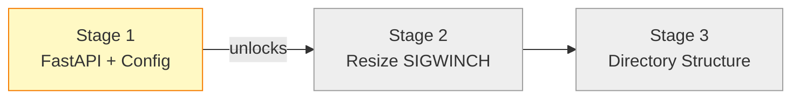

# Progress: Child #2 — Phase 0: FastAPI Migration + Refactor

**Issue**: [#2](https://github.com/info-tech-io/web-terminal/issues/2)
**Epic**: [#1](https://github.com/info-tech-io/web-terminal/issues/1)

## Status Dashboard

## Timeline

| Stage | Status | Started | Completed | Commits |
|-------|--------|---------|-----------|---------|
| 1. FastAPI + Config | 🔄 In Progress | 2026-03-21 | — | — |
| 2. Terminal Resize | ⏳ Planned | — | — | — |
| 3. Directory Structure | ⏳ Planned | — | — | — |
