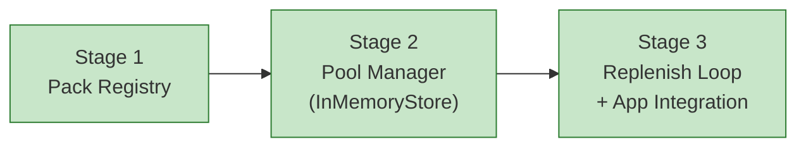

# Progress: Child #3 — Phase 1-A: Pack Registry + Pool Manager

**Issue**: [#3](https://github.com/info-tech-io/web-terminal/issues/3)
**Status**: ✅ Complete

## Status Dashboard

## Timeline

| Stage | Status | Started | Completed | Commits |
|-------|--------|---------|-----------|---------|
| 1. Pack Registry | ✅ Complete | 2026-03-21 | 2026-03-21 | feat(child-3): stage 1 |
| 2. Pool Manager (InMemoryStore) | ✅ Complete | 2026-03-21 | 2026-03-21 | feat(child-3): stage 2 |
| 3. Replenish Loop + App Integration | ✅ Complete | 2026-03-21 | 2026-03-21 | feat(child-3): stage 3 |

## Notes

- Redis заменён на `InMemoryStore` для MVP. Абстракция `PoolStore` позволит
  подключить `RedisStore` без изменений в `PoolManager` (Фаза 2+).
- `packs_dir` вынесен в `Settings` (`.env` / env var `TPS_PACKS_DIR`).
- Старый `/ws` эндпоинт сохранён до Child #4 (Session API + JWT).

## Definition of Done

- [x] `GET /api/packs` возвращает список паков с `pool_warm` и `pool_busy` счётчиками
- [x] Pool Manager держит N warm-контейнеров согласно `pack.json`
- [x] `allocate` возвращает `None` при пустом пуле (→ 503 в Session API)
- [x] После `release` новый контейнер поднимается автоматически
