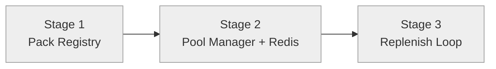

# Progress: Child #3 — Phase 1-A: Pack Registry + Pool Manager

**Issue**: [#3](https://github.com/info-tech-io/web-terminal/issues/3)
**Status**: ⏳ Planned

## Status Dashboard

## Timeline

| Stage | Status | Started | Completed | Commits |
|-------|--------|---------|-----------|---------|
| 1. Pack Registry | ⏳ Planned | — | — | — |
| 2. Pool Manager + Redis | ⏳ Planned | — | — | — |
| 3. Replenish Loop | ⏳ Planned | — | — | — |
