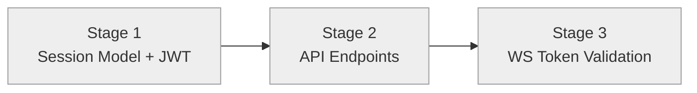

# Progress: Child #4 — Phase 1-B: Session API with JWT

**Issue**: [#4](https://github.com/info-tech-io/web-terminal/issues/4)
**Status**: ⏳ Planned

## Status Dashboard

## Timeline

| Stage | Status | Started | Completed | Commits |
|-------|--------|---------|-----------|---------|
| 1. Session Model + JWT | ⏳ Planned | — | — | — |
| 2. API Endpoints | ⏳ Planned | — | — | — |
| 3. WS Token Validation | ⏳ Planned | — | — | — |
