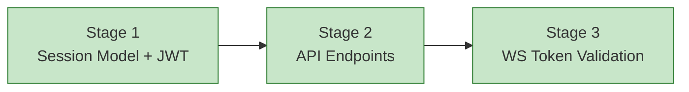

# Progress: Child #4 — Phase 1-B: Session API with JWT

**Issue**: [#4](https://github.com/info-tech-io/web-terminal/issues/4)
**Status**: ✅ Complete

## Status Dashboard

## Timeline

| Stage | Status | Started | Completed | Commits |
|-------|--------|---------|-----------|---------|
| 1. Session Model + JWT | ✅ Complete | 2026-03-21 | 2026-03-21 | feat(issue-4): stage 1 |
| 2. API Endpoints | ✅ Complete | 2026-03-21 | 2026-03-21 | feat(issue-4): stage 2+3 |
| 3. WS Token Validation | ✅ Complete | 2026-03-21 | 2026-03-21 | feat(issue-4): stage 2+3 |
