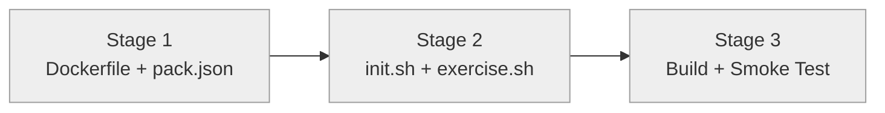

# Progress: Child #5 — Phase 1-C: Pack rustlings

**Issue**: [#5](https://github.com/info-tech-io/web-terminal/issues/5)
**Status**: ⏳ Planned

## Status Dashboard

## Timeline

| Stage | Status | Started | Completed | Commits |
|-------|--------|---------|-----------|---------|
| 1. Dockerfile + pack.json | ⏳ Planned | — | — | — |
| 2. init.sh + exercise.sh | ⏳ Planned | — | — | — |
| 3. Build + Smoke Test | ⏳ Planned | — | — | — |
