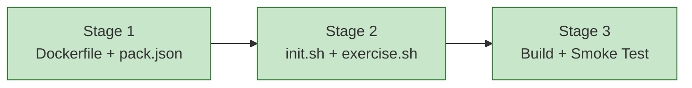

# Прогресс: Child #5 — Phase 1-C: Pack rustlings

**Issue**: [#5](https://github.com/info-tech-io/web-terminal/issues/5)
**Статус**: ✅ Завершён

## Дашборд

## Хронология

| Stage | Статус | Начат | Завершён | Коммиты |
|-------|--------|-------|----------|---------|
| 1. Dockerfile + pack.json | ✅ Завершён | 2026-03-21 | 2026-03-21 | c9e4b41 |
| 2. init.sh + exercise.sh | ✅ Завершён | 2026-03-21 | 2026-03-21 | a5909dd, c9e4b41 |
| 3. Build + Smoke Test | ✅ Завершён | 2026-03-21 | 2026-03-21 | (текущий коммит) |

## Definition of Done

- [x] `docker build -t tps-rustlings packs/rustlings/` проходит без ошибок
- [x] `init.sh` инициализирует rustlings и выводит финальное сообщение
- [x] `exercise.sh intro1` открывает упражнение (`✓ Successfully ran intro1`)
- [x] `pack.json` содержит 95 упражнений с корректными ID
