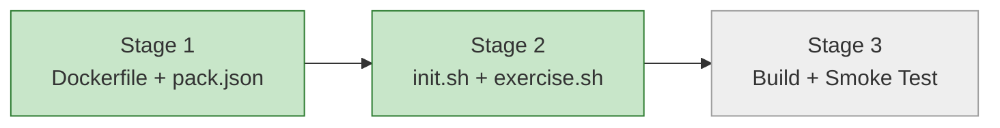

# Progress: Child #5 — Phase 1-C: Pack rustlings

**Issue**: [#5](https://github.com/info-tech-io/web-terminal/issues/5)
**Status**: 🔄 In Progress

## Status Dashboard

## Timeline

| Stage | Status | Started | Completed | Commits |
|-------|--------|---------|-----------|---------|
| 1. Dockerfile + pack.json | ✅ Complete | 2026-03-21 | 2026-03-21 | feat(issue-5): fill pack.json |
| 2. init.sh + exercise.sh | ✅ Complete | 2026-03-21 | 2026-03-21 | a5909dd (Phase 0) |
| 3. Build + Smoke Test | ⏳ Planned | — | — | — |
