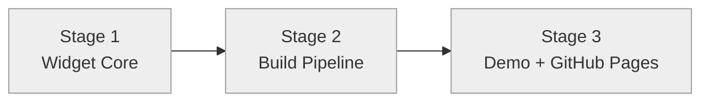

# Progress: Child #6 — Phase 1-D: JS Widget v1 + Demo Page

**Issue**: [#6](https://github.com/info-tech-io/web-terminal/issues/6)
**Status**: ⏳ Planned

## Status Dashboard

## Timeline

| Stage | Status | Started | Completed | Commits |
|-------|--------|---------|-----------|---------|
| 1. Widget Core | ⏳ Planned | — | — | — |
| 2. Build Pipeline | ⏳ Planned | — | — | — |
| 3. Demo + GitHub Pages | ⏳ Planned | — | — | — |
