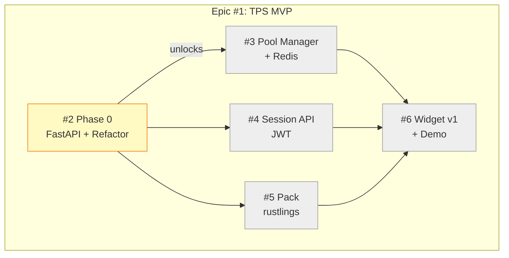

# Progress: Epic #1 — TPS MVP

## Epic Status Dashboard

## Child Issues Summary

| Child | Title | Status | Progress |
|-------|-------|--------|----------|
| [#2](https://github.com/info-tech-io/web-terminal/issues/2) | Phase 0: FastAPI + Refactor | 🔄 In Progress | 0% |
| [#3](https://github.com/info-tech-io/web-terminal/issues/3) | Phase 1-A: Pool Manager + Redis | ⏳ Planned | 0% |
| [#4](https://github.com/info-tech-io/web-terminal/issues/4) | Phase 1-B: Session API | ⏳ Planned | 0% |
| [#5](https://github.com/info-tech-io/web-terminal/issues/5) | Phase 1-C: Pack rustlings | ⏳ Planned | 0% |
| [#6](https://github.com/info-tech-io/web-terminal/issues/6) | Phase 1-D: Widget v1 + Demo | ⏳ Planned | 0% |

## Metrics

- **Overall Progress**: 0% (0/5 children complete)
- **Started**: 2026-03-21
- **Target**: TBD
