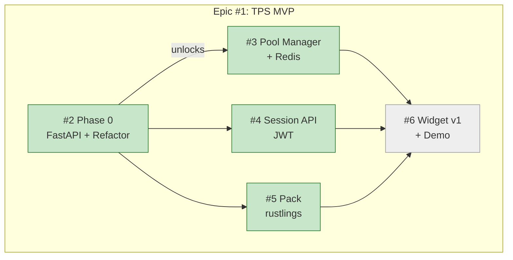

# Прогресс: Epic #1 — TPS MVP

## Дашборд

## Сводка по child issues

| Child | Название | Статус | Прогресс |
|-------|----------|--------|----------|
| [#2](https://github.com/info-tech-io/web-terminal/issues/2) | Phase 0: FastAPI + Refactor | ✅ Завершён | 100% |
| [#3](https://github.com/info-tech-io/web-terminal/issues/3) | Phase 1-A: Pool Manager + Redis | ✅ Завершён | 100% |
| [#4](https://github.com/info-tech-io/web-terminal/issues/4) | Phase 1-B: Session API | ✅ Завершён | 100% |
| [#5](https://github.com/info-tech-io/web-terminal/issues/5) | Phase 1-C: Pack rustlings | ✅ Завершён | 100% |
| [#6](https://github.com/info-tech-io/web-terminal/issues/6) | Phase 1-D: Widget v1 + Demo | ⏳ Запланирован | 0% |

## Метрики

- **Общий прогресс**: 80% (4/5 child issues завершены)
- **Начат**: 2026-03-21
- **Цель**: TBD
