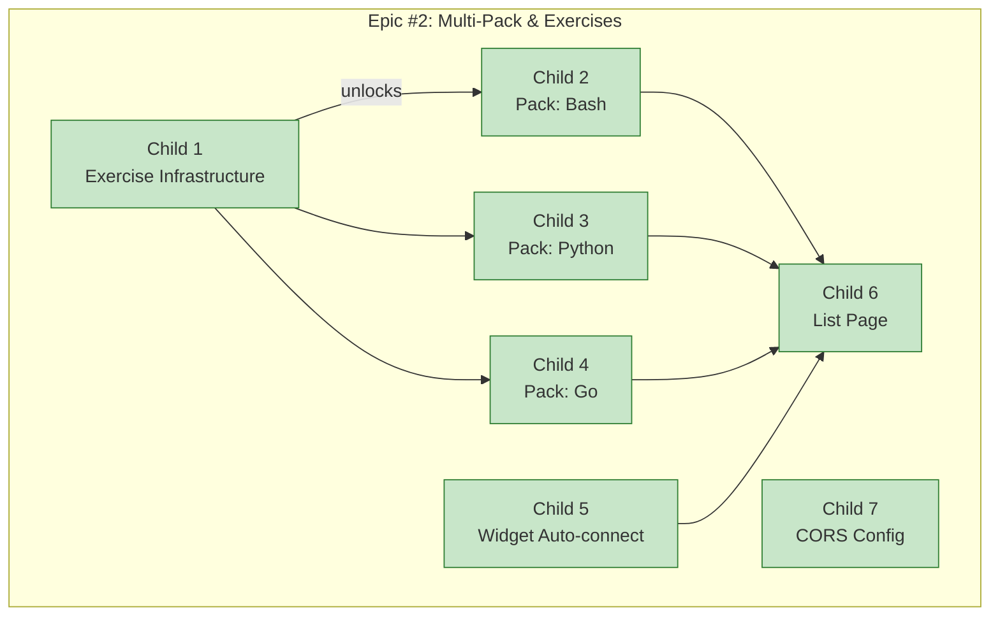

# Прогресс: Epic #2 — Мульти-пак и упражнения

## Дашборд

## Сводка по child issues

| Child | Название | Статус | Прогресс |
|-------|----------|--------|----------|
| Child 1 | Exercise Infrastructure | ✅ Выполнен | 100% |
| Child 2 | Pack: Bash | ✅ Выполнен | 100% |
| Child 3 | Pack: Python | ✅ Выполнен | 100% |
| Child 4 | Pack: Go | ✅ Выполнен | 100% |
| Child 5 | Виджет: автоподключение | ✅ Выполнен | 100% |
| Child 6 | Главная страница | ✅ Выполнен | 100% |
| Child 7 | CORS конфиг | ✅ Выполнен | 100% |

## Метрики

- **Общий прогресс**: 100% (7/7 child issues завершены)
- **Начат**: 2026-05-10
- **Реализован**: 2026-05-10

## Ручные шаги для деплоя

- [ ] `docker build -t tps-python packs/python/`
- [ ] `docker build -t tps-go packs/go/`
- [ ] Перезапустить сервис: `sudo systemctl restart tps`
- [ ] Проверить `GET /api/packs` — bash/python/go с exercises
- [ ] Открыть `GET /` — список упражнений по курсам
- [ ] Кликнуть упражнение → терминал открывается → `check` работает
